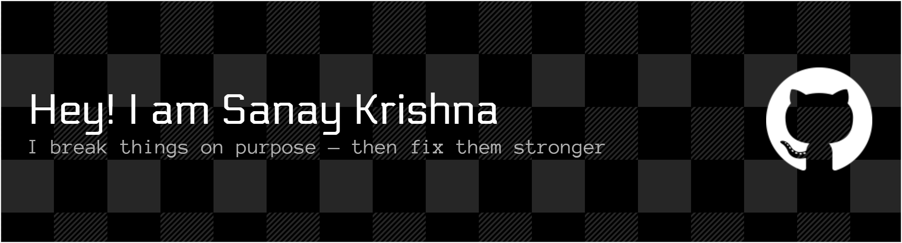

<i>On a Path to Offensive Security | Security Tools, Pentesting & Web Exploits</i>

🚀 About Me
💻 Developer with an offensive security mindset - 🔍 Fascinated by the art of ethical hacking - 🐍 Strong foundation in Python development - 🛡️ Passionate about finding and patching security flaws ---

🛠️ Skills
💻 Programming & Web Development

⚙️ Frameworks

🗄️ Databases

⚡ Fun Fact
☕ I drink more coffee than my programs consume memory

📊 GitHub Stats

🐍 Contribution Snake

<picture>
<source media="(prefers-color-scheme: dark)" srcset="https://raw.githubusercontent.com/SanayKrishna/SanayKrishna/output/github-contribution-grid-snake-dark.svg">
<source media="(prefers-color-scheme: light)" srcset="https://raw.githubusercontent.com/SanayKrishna/SanayKrishna/output/github-contribution-grid-snake-light.svg">

</picture>

